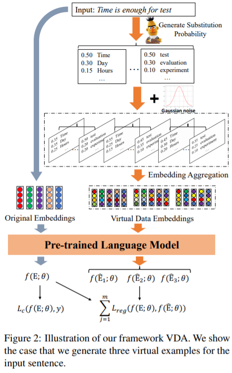

## Virtual Data Augmentation: A Robust and General Framework for Fine-tuning Pre-trained Models

This repository contains the code for our paper VDA (public in EMNLP2021 main conference)

## Quick Links

  - [Overview](#overview)
  - [Train VDA](#train-vda)
    - [Training](#training)
    - [Evaluation](#evaluation)
  - [Citation](#citation)

## Overview

We propose a general framework ***Virtual Data Augmentation (VDA)*** for robustly fine-tuning Pre-trained Language Models for downstream tasks. Our VDA utilizes a masked language model with Gaussian noise to augment virtual examples for improving the robustness, and also adopts regularized training to further guarantee the semantic relevance and diversity.



## Train VDA

In the following section, we describe how to train a model with VDA by using our code.

### Training

**Data**

For evaluation of our VDA, we use 6 text classification datasets, i.e. Yelp, IMDB, AGNews, MR, QNLI and MRPC datasets. These datasets can be downloaded from the [GoogleDisk](https://drive.google.com/drive/folders/10Tl2kc6n-mtbAFnk_u0S2Q2cQjNMPR_7?usp=sharing)

After download the two ziped files, users should unzip the ***data*** fold that contains the training, validation and test data of the 6 datasets. While the ***Robust*** fold contains the examples for test the robustness.

**Training scripts**
We public our VDA with 4 base models. For single sentence classification tasks, we use ***text_classifier_xxx.py*** files. While for sentence pair classification tasks, we use ***text_pair_classifier_xxx.py***:

* ***text_classifier.py*** and ***text_pair_classifier.py***: BERT-base+VDA

* ***text_classifier_freelb.py*** and ***text_pair_classifier_freelb.py***: FreeLB+VDA on BERT-base

* ***text_classifier_smart.py*** and ***text_pair_classifier_smart.py***: SMART+VDA on BERT-base, where we only use the smooth-inducing adversarial regularization.

* ***text_classifier_smix.py*** and ***text_pair_classifier_smix.py***: Smix+VDA on BERT-base, where we remove the adversarial data augmentation for fair comparison

We provide example scripts for both training and test of our VDA on the 6 datasets. In `run_train.sh`, we provide 6 example for training on the yelp and qnli datasets. This script calls `text_classifier_xxx.py` for training (xxx refers to the base model). We explain the arguments in following:
* `--dataset`: Training file path.
* `--mlm_path`: Pre-trained checkpoints to start with. For now we support BERT-based models (`bert-base-uncased`, `bert-large-uncased`, etc.)
* `--save_path`: Saved fine-tuned checkpoints file.
* `--max_length`: Max sequence length. (For Yelp/IMDB/AG, we use 512. While for MR/QNLI/MRPC, we use 256.)
* `--max_epoch`: The maximum training epoch number. (In most of datasets and models, we use 10.)
* `--batch_size`: The batch size. (We adapt the batch size to the maximum number w.r.t the GPU memory size. Note that too small number may cause model collapse.)
* `--num_label`: The number of labels. (For AG, we use 4. While for other, we use 2.)
* `--lr`: Learning rate.
* `--num_warmup`: The rate of warm-up steps.
* `--variance`: The variance of the Gaussian noise.

For results in the paper, we use Nvidia Tesla V100 32G and Nvidia 3090 24G GPUs to train our models. Using different types of devices or different versions of CUDA/other softwares may lead to slightly different performance.

### Evaluation

During training, our model file will show the original accuracy on the test set of the 6 datasets, which evaluates the accuracy performance of our model.
Our evaluation code for robustness is based on a modified version of [BERT-Attack](https://github.com/LinyangLee/BERT-Attack). It outputs Attack Accuracy, Query Numbers and Perturbation Ratio metrics.

Before evaluation, please download the evaluation datasets for Robustness from the [GoogleDisk](https://drive.google.com/drive/folders/10Tl2kc6n-mtbAFnk_u0S2Q2cQjNMPR_7?usp=sharing).
Then, following the commonly-used settings, users need to download and process consine similarity matrix following [TextFooler](https://github.com/jind11/TextFooler).

Based on the checkpoint of the fine-tuned models, we use the`run_test.sh` script for test the robustness on yelp and qnli datasets. It is based on `bert_robust.py` file. We explain the arguments in following:
* `--data_path`: Training file path.
* `--mlm_path`: Pre-trained checkpoints to start with. For now we support BERT-based models (`bert-base-uncased`, `bert-large-uncased`, etc.)
* `--tgt_path`: The fine-tuned checkpoints file.
* `--num_label`: The number of labels. (For AG, we use 4. While for other, we use 2.)

which is expected to output the results as:
```
original accuracy is 0.960000, attack accuracy is 0.533333, query num is 687.680556, perturb rate is 0.177204
```

## Citation

Please cite our paper if you use VDA in your work:

```bibtex
@inproceedings{zhou2021vda,
  author    = {Kun Zhou, Wayne Xin Zhao, Sirui Wang, Fuzheng Zhang, Wei Wu and Ji-Rong Wen},
  title     = {Virtual Data Augmentation: A Robust and General Framework for Fine-tuning Pre-trained Models},
  booktitle = {{EMNLP} 2021},
  publisher = {The Association for Computational Linguistics},
}
```
